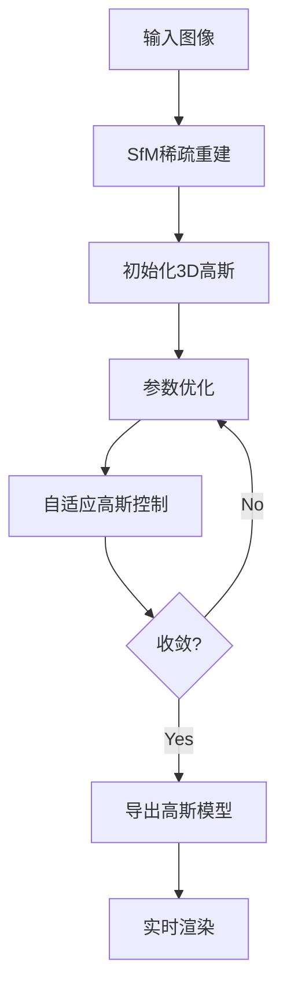

+++
authors = ["李佳潞"]
title = "3D Gaussian Splatting"
date = "2025-01-20"
categories = [
    "计算机视觉"
]
series = [""]
tags = [
    "3DGS","机器学习"
]
+++

- [_代码部分_](#代码部分)
  - [一. 程序](#一-程序)
  - [二. 问题](#二-问题)
  - [三. 说明](#三-说明)
  - [四. 本地复现](#四-本地复现)
  - [五. 部分代码逻辑](#五-部分代码逻辑)
- [_论文部分_](#论文部分)
  - [一. 前置内容](#一-前置内容)
  - [二. 论文逻辑](#二-论文逻辑)
- [3D Gaussian Splatting Pipeline](#3d-gaussian-splatting-pipeline)
  - [1. **初始化阶段**](#1-初始化阶段)
    - [输入：多视角图像 + 稀疏点云（如COLMAP/SfM生成）](#输入多视角图像--稀疏点云如colmapsfm生成)
  - [2. **参数优化阶段**](#2-参数优化阶段)
    - [优化目标：最小化渲染图像与GT的差异（L1 + SSIM Loss）](#优化目标最小化渲染图像与gt的差异l1--ssim-loss)
  - [3. **自适应高斯控制**](#3-自适应高斯控制)
    - [动态调整高斯数量与分布](#动态调整高斯数量与分布)
  - [4. **可微分光栅化渲染**](#4-可微分光栅化渲染)
    - [渲染方程：将3D高斯投影到2D屏幕空间](#渲染方程将3d高斯投影到2d屏幕空间)
  - [5. **训练与推理流程**](#5-训练与推理流程)

# _代码部分_

## 一. 程序

[github源码](https://github.com/graphdeco-inria/gaussian-splatting)


## 二. 问题

conda 安装过程：

1. 下载 pytorch 的 cuda 版本，结果是 cpu 版本
   
    [参考链接](https://blog.csdn.net/u013468614/article/details/125910538)

2. undefined symbol: iJIT_NotifyEvent
    原因：大概率是 docker 容器内与 conda 环境不匹配导致。
    现象：错误 libtorch_cpu.so: undefined symbol: iJIT_NotifyEvent，解决：尝试运行 pip install mkl==2024.0

## 三. 说明

[官方链接](https://www.youtube.com/watch?v=UXtuigy_wYc)

[参考链接](https://blog.csdn.net/Mekjeri/article/details/135716907?utm_source=chatgpt.com)

## 四. 本地复现

1. 自己数据集制作：

   需要：colmap 和 ffmpeg

2. conda 运行：

   如果 conda 内缺少 libgl，因为我是在 docker 容器中运行的，需要安装 libgl。

   ```bash
   conda install -c conda-forge libgl
   ```

3. 可视化 SIBR_viewers

   ```bash
   # Dependencies
   sudo apt install -y libglew-dev libassimp-dev libboost-all-dev libgtk-3-dev libopencv-dev libglfw3-dev libavdevice-dev libavcodec-dev libeigen3-dev libxxf86vm-dev libembree-dev

   # Project setup
   cd SIBR_viewers
   git checkout fossa_compatibility # 如果是22.04就不需要加这个指令
   cmake -Bbuild . -DCMAKE_BUILD_TYPE=Release # add -G Ninja to build faster
   cmake --build build -j24 --target install

   # run
   ./install/bin/SIBR_gaussianViewer_app -m ../output/water_bottle/
   ```

   如果是在 conda 内运行可视化，会出现 x11 问题：

   ```bash
   [SIBR] ##  ERROR  ##:   FILE /workspace/gaussian-splatting/SIBR_viewers/src/core/graphics/Window.cpp
                           LINE 30, FUNC glfwErrorCallback
                           GLX: Failed to create context: GLXBadFBConfig
   ```

   解决方法：
   a. 宿主机

   ```bash
   glxinfo| grep OpenGL #查看OpenGL core profile version string' = 4.6
   ```

   b. docker 容器内

   ```bash
   export MESA_GL_VERSION_OVERRIDE=4.6
   ```

   c. docker 容器内

   ```bash
   ./install/bin/SIBR_gaussianViewer_app -m ../output/water_bottle/
   ```

    [参考链接](https://github.com/graphdeco-inria/gaussian-splatting/issues/267#issuecomment-1840760152)


4. 本地数据测试

   手机录制原始数据视频：

   <div class="container" style="display: flex; justify-content: center;">
       <video controls width="360" height="640">
           <source src="/videos/work-record/ori_water_bottle.mp4" type="video/mp4">
       </video>
   </div>

   **SIBR**：

   <div class="container" style="display: flex; justify-content: center;">
       <video controls width="640" height="360">
           <source src="/videos/work-record/SIBR_water_bottle.mp4" type="video/mp4">
       </video>
   </div>

   高斯分布可视化：

   <div class="twenty-container" style="position: relative; width: 80%; max-width: 500px; height: 700px; overflow: hidden; border-radius: 10px; display: flex; justify-content: center;">
       
       
       <div class="twenty-handle" style="position: absolute; top: 0; left: 50%; width: 20px; height: 100%; background-color: rgba(255, 255, 255, 0.7); cursor: pointer; z-index: 10; border-radius: 50%;"></div>
   </div>

   <script>
       const handle = document.querySelector('.twenty-handle');
       const beforeImg = document.querySelector('.twenty-before');
       const afterImg = document.querySelector('.twenty-after');
   
       // Initialize handle position
       let handlePosition = handle.offsetLeft;
   
       // Function to update the clipping based on the handle position
       function updateClipPosition() {
           beforeImg.style.clip = `rect(0px, ${handlePosition}px, 700px, 0px)`;
           afterImg.style.clip = `rect(0px, 500px, 700px, ${handlePosition}px)`;
       }
   
       // Initially set the clip for both images
       updateClipPosition();
   
       handle.addEventListener('mousedown', (e) => {
           const startX = e.clientX;
           const initialLeft = handlePosition;
   
           const onMouseMove = (moveEvent) => {
               const diffX = moveEvent.clientX - startX;
               let newLeft = initialLeft + diffX;
   
               // Limit the handle movement within the container bounds
               newLeft = Math.max(0, Math.min(newLeft, handle.parentElement.offsetWidth));
   
               handlePosition = newLeft;
               handle.style.left = `${handlePosition}px`;
   
               updateClipPosition();
           };
   
           const onMouseUp = () => {
               document.removeEventListener('mousemove', onMouseMove);
               document.removeEventListener('mouseup', onMouseUp);
           };
   
           document.addEventListener('mousemove', onMouseMove);
           document.addEventListener('mouseup', onMouseUp);
       });
   </script>

## 五. 部分代码逻辑
- 渲染部分：通过C++/cuda渲染
- todo

# _论文部分_

## 一. 前置内容

1. **稀疏/半稠密/稠密 SLAM**
   稀疏 SLAM：
   传统视觉 SLAM，如 vins-mono，通过计算图像中特征点的匹配关系，来确定相机运动轨迹。构建地图的信息量少，无法描述整个场景的全局结构。
   半稠密 SLAM：
   激光雷达 SLAM，如 LIO-SAM，通过激光扫描仪扫描出地图，构建地图的信息量多，但也无法描述整个场景的全局结构。
   稠密 SLAM：
   通过生成网格(mesh)或稠密点云(pointcloud)或高斯椭球(gaussian splatting)，如 3DGS-SLAM，来描述整个场景的全局结构。在自动驾驶中，可以提供更详细的环境重建信息，帮助下游系统识别道路障碍物、行人和其他重要物体，为路径规划和决策提供更精确的数据。

2. **结构光束法(Structure-from-Motion sfm)**
   概念：
   通过从多个视角拍摄的图片中推断出 3D 结构的技术。通过该方法，能从一组 2D 图像中提取出 3D 场景的几何信息，生成稀疏点云。
   过程：
   (1) 输入图像：SFM 方法通常依赖于至少两张或更多的相机视角，从中提取出图像特征点。
   (2) 特征匹配：从这些图像中提取特征点，并通过图像匹配技术（例如，SIFT、SURF 等）来找到这些特征在不同图像中的对应关系。
   (SIFT 和 SURF 是两种常见的特征提取算法，它们都基于图像的纹理信息，可以提取出图像中的关键点，并通过匹配算法来确定关键点的对应关系。)
   (3) 计算相机位置和方向：SFM 方法还可以估计相机的运动轨迹（即相机的位置和朝向），这些信息有助于推算出特征点在三维空间中的位置。
   (4) 三维重建：通过三角测量等几何方法，将图像中匹配的特征点转换成三维空间中的点，生成稀疏点云。

3. **稀疏点云**
   特性：
   (1) 稀疏：由于 SFM 方法通常依赖于图像中可识别的特征（如角点或边缘），而这些特征点并不能覆盖整个场景。因此，稀疏点云的点数相对较少，且分布在场景中较为分散。
   (2) 不完整：这些点仅代表场景中的特定部分，如重要的角点或边界，无法完全描述整个场景的几何形状，通常需要通过其他技术（如传统 MVS / 流行的 3dgs）来填补空缺并生成稠密点云。

4. **colmap**
   概念：
   开源的三维重建软件，结合了**结构光束法（SfM）和多视图立体（MVS）**技术，提供图形和命令行界面。 它能够从有序或无序的图像集合中，自动提取特征、匹配特征点、估计相机位姿，并生成稀疏和稠密的三维点云。 COLMAP 广泛应用于计算机视觉、三维建模、增强现实等领域。

5. **快速光栅化 (Fast Rasterization)**
   概念：
   渲染技术一种。将三维场景中的几何图形（如线条、多边形）转换为二维像素网格，以便在显示设备上呈现图像。 是图形渲染中的一个步骤。快速光栅化（Fast Rasterization）是通过优化算法加速将 3D 模型转换为 2D 图像的像素的过程。

6. **体积渲染 (Volumetric Rendering)**
   概念：
   渲染技术一种。它不仅考虑场景的表面，还关注场景中的体积数据。通过模拟光在不同介质（如烟雾、云朵、雾霾等）中的传播，体积渲染能够生成更加真实和细致的视觉效果。通常用于优化 3D 数据，尤其是在 半透明物体 或 复杂光传播 场景的渲染中。然而，在 3D Gaussian Splatting (3DGS) 中，体积渲染的应用更侧重于优化 2D 图像。

7. **blender**
   概念：
   开源的三维渲染软件。一旦三维点云数据导入到 Blender 中，就可以对这些点云进行可视化和渲染。在 Blender 中，可以使用包括 **体积渲染 (Volumetric Rendering)和快速光栅化 (Fast Rasterization)** 等技术来优化渲染效果。
  
8. **FOVX and FOVY**
   示意图：
       |<---- sensor size ---->|
       |-----------------------|
       |       /|\             |
       |      / | \            |
       |     /  |  \           |
       |    /   |   \          |
       |---|---O---|---|       |
           |  focal |
    公式：
    FOVX  = 2 * atan(sensor_size_x / (2 * focal_length_x))
    FOVY 同理
    
## 二. 论文逻辑

# 3D Gaussian Splatting Pipeline

## 1. **初始化阶段**  
### 输入：多视角图像 + 稀疏点云（如COLMAP/SfM生成）
- **目标**：将稀疏点云转换为初始3D高斯集合  
- **关键操作**：
  - 每个3D点初始化为一个各向同性高斯（协方差矩阵为对角矩阵，缩放由点云密度自适应决定）
  - 初始颜色通过多视角图像反投影计算均值颜色
  - 不透明度（α）初始化为均匀值（如0.5）

---

## 2. **参数优化阶段**  
### 优化目标：最小化渲染图像与GT的差异（L1 + SSIM Loss）
- **优化参数**：
  - **几何参数**：
    - 位置（μ ∈ ℝ³）
    - 协方差矩阵（Σ ∈ ℝ³×³，通过旋转矩阵𝑅和缩放矩阵𝑆参数化为：Σ = 𝑅𝑆𝑆ᵀ𝑅ᵀ）
  - **外观参数**：
    - 不透明度（α ∈ [0,1]）
    - 球谐系数（SH Coefficients ∈ ℝⁿ，用于视角相关颜色建模）
- **优化方法**：
  - 使用可微分光栅化计算梯度
  - 基于Adam优化器迭代更新参数

---

## 3. **自适应高斯控制**  
### 动态调整高斯数量与分布
- **高斯增加**：
  - **条件**：当某区域重建误差（梯度）过高时
  - **操作**：将大高斯分裂为多个小高斯（沿梯度方向细分）
- **高斯修剪**：
  - **条件**：当高斯不透明度（α）低于阈值或对渲染贡献可忽略
  - **操作**：直接移除低贡献高斯
- **高斯合并**：
  - **条件**：当相邻高斯参数相似时（如位置、颜色相近）
  - **操作**：合并为单一高斯以降低计算量

---

## 4. **可微分光栅化渲染**  
### 渲染方程：将3D高斯投影到2D屏幕空间
- **步骤**：
  1. **投影变换**：
     - 将3D高斯椭球投影到2D屏幕空间，计算2D协方差矩阵（Σ'）
  2. **排序与混合**：
     - 按深度对高斯进行快速排序（近似Front-to-Back）
  3. **像素着色**：
     - 对每个像素覆盖的高斯进行透明度混合（Alpha Blending）
     - 颜色计算：`C = Σ(α_i * c_i * ∏(1 - α_j))`（j < i）

---

## 5. **训练与推理流程**
